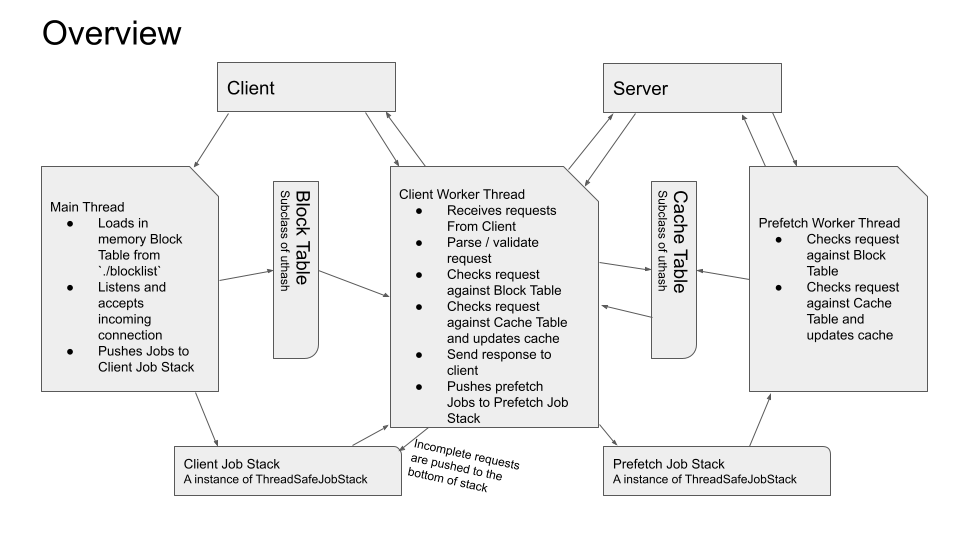

# PA3 - HTTP Proxy

## what is in the makefile?

- do `make server` to compile server executable. 
The finished binary will be at ./executables/server the default cache root is ./executables/cache
- there are some non-automated unit tests, do `make tests` to compile them.  
- there are some small scale experiments I used to learn about the behaviour HTTP. do `make experiments` to compile them.

## few thing to note 

- while a resource is being retrieved the first time from server, before it is finished. 
The `cache_record_get_or_create` will return an unavailable status when another thread checks the same resource
This means if a resource is requested in quick succession, the first few requests will trigger a server get. 
The rationale behind this is that coordinating reading incomplete cache file is risky 
and blocking subsequent requests untill the first one finishes is bad for responsiveness to interactive users. 
- while the cache files are stored on disk, the cache record used for retrieving 
and coordinating multiple reader / writer thread lives in memory and will be lost after server shutdown. 
This means cached responses do not persist past the lifetime of the server program.

## want to see extra printout?

- files such as `thread-safe-job-stack.c` and `worker.c` have DEBUG flags that will enable more printouts. 

## Library / works cited

- `uthash.h` is a hash table `library` maintained by Troy D. Hanson see https://troydhanson.github.io/uthash/  
- `request.c` is an HTTP test client made by Prof.Schreuder. The server does not include any code from it.  